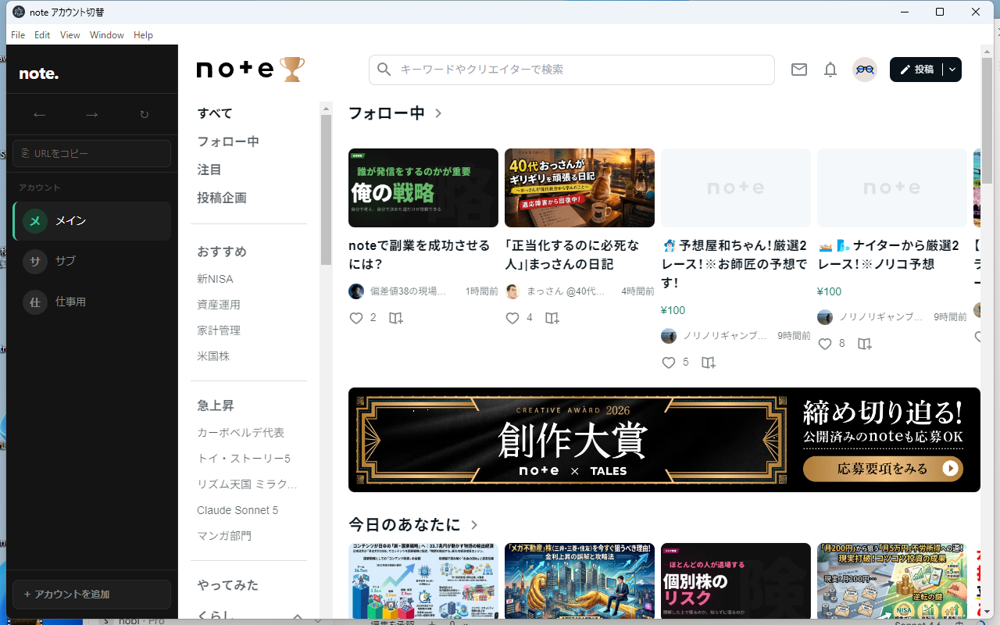

# Note Deck

note.comのマルチアカウントをデスクトップで切り替えるElectronアプリ  
Desktop app to switch between multiple note.com accounts instantly. Built with Electron.



---

## 日本語

### これは何？

note.comの複数アカウントを、ログインし直すことなくワンクリックで切り替えられるデスクトップアプリです。  
GoogleアカウントでのOAuth認証にも完全対応しています。

Chromeの拡張機能「Multi Note」を参考にしましたが、個人情報を扱う可能性があるため自作しました。

### 機能

- ワンクリックでアカウント切り替え
- Googleログイン完全対応（OAuth認証）
- アカウント数無制限
- 戻る・進む・再読み込みナビゲーション
- URLワンクリックコピー

### ダウンロード（Windows）

[Releases](https://github.com/nobinobi9000/note-multi-account/releases/latest) からZIPをダウンロードして展開し、  
`note アカウント切替.exe` を実行するだけ。インストール不要。

> **初回起動時の注意**  
> 「WindowsによってPCが保護されました」と表示された場合は、「詳細情報」→「実行」で起動できます。

### Mac / Linux

バイナリ配布はありませんが、ソースからビルドして動作します。

### 開発・ビルド

```bash
git clone https://github.com/nobinobi9000/note-multi-account.git
cd note-multi-account
npm install
npm start       # 起動
npm run dist    # Windowsビルド（要electron-builder）
```

---

## English

### What is this?

A desktop app that lets you switch between multiple note.com accounts with one click — no re-login required.  
Google OAuth authentication is fully supported.

Inspired by the Chrome extension "Multi Note", but built from scratch for privacy reasons.

### Features

- One-click account switching
- Full Google OAuth support
- Unlimited accounts
- Back / Forward / Reload navigation
- One-click URL copy

### Download (Windows)

Download the ZIP from [Releases](https://github.com/nobinobi9000/note-multi-account/releases/latest), extract it, and run `note アカウント切替.exe`.  
No installation required.

> **First launch note**  
> If Windows shows "Windows protected your PC", click "More info" → "Run anyway".

### Mac / Linux

No binary distribution yet, but you can build from source.

### Development / Build

```bash
git clone https://github.com/nobinobi9000/note-multi-account.git
cd note-multi-account
npm install
npm start       # Run
npm run dist    # Build for Windows (requires electron-builder)
```

---

## License

MIT
